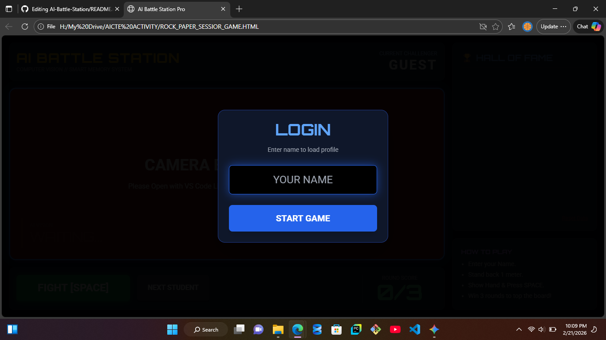
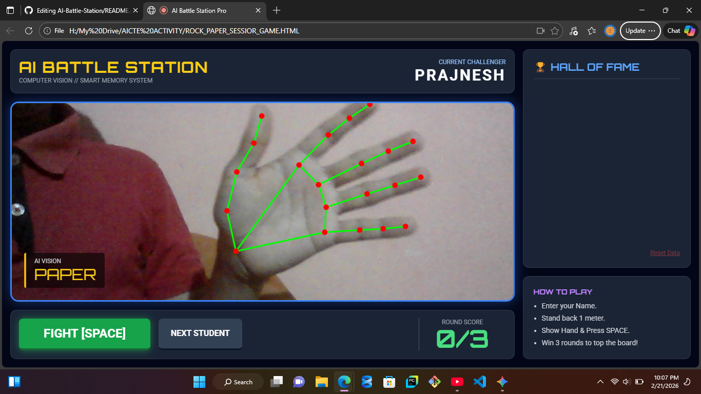
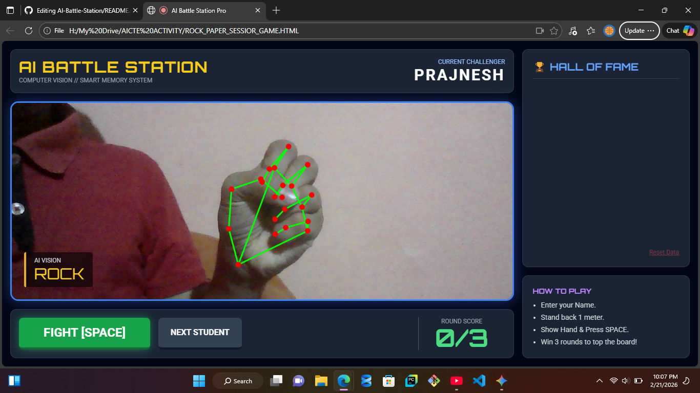
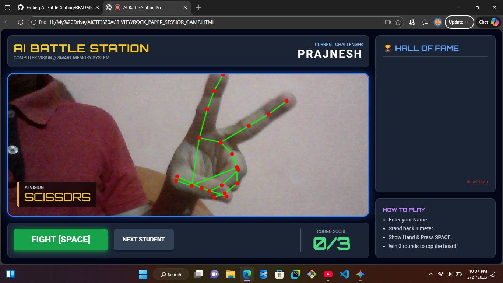

# AI-Battle-Station
eal-time Rock-Paper-Scissors game using MediaPipe and OpenCV. Now you battle wit AI see who are the ultimate winner of Rock ,Paper and scissor(single player mode)
🎮 AI Battle Station: Real-Time Gesture Recognition
A Computer Vision-powered Rock-Paper-Scissors game featuring a Deep Learning hand-tracking system, a persistent leaderboard, and dual-platform deployment (Python & Web).

🚀 Project Overview
This project demonstrates the practical application of Artificial Intelligence in interactive gaming. By leveraging MediaPipe's Hand Landmark Detection, the system interprets human hand gestures in real-time to play against an AI opponent. It features a robust scoring system, a "Battle Station" themed UI, and a leaderboard to track high scores across different players.

## 🖼️ Project Gallery

| Login Screen | Paper Gesture | Rock Gesture | Scissors Gesture |
| :---: | :---: | :---: | :---: |
|  |  |  |  |

✨ Key Features
Precision Hand Tracking: Tracks 21 3D landmarks to identify Rock, Paper, and Scissors gestures with high reliability.

Dual Deployment: * Desktop Pro: High-performance Python version using OpenCV for rendering and JSON for local data persistence.

Web Lite: Browser-ready version using Tailwind CSS and the MediaPipe JavaScript API.

Smart Leaderboard: Automatically saves and displays player rankings using JSON (Python) and LocalStorage (Web).

Admin Bonus Mode: Includes a hidden admin panel to grant extra rounds to specific challengers.

🛠 Technology Stack
Core Engine: Python 3.10+

AI Framework: Google MediaPipe (Hand Detection)

Computer Vision: OpenCV (Video processing & UI Overlay)

Frontend (Web): HTML5, Tailwind CSS, JavaScript

Data Management: JSON & LocalStorage

📂 Repository Structure
Plaintext

├── GAME.PY                      # Main Python logic & Desktop UI
├── ROCK_PAPER_SCISSORS_GAME.HTML # Web-based game deployment
├── leaderboard.json             # Local database for player scores
├── requirements.txt             # Python project dependencies
└── README.md                    # Project documentation
💻 Installation & Usage (Desktop)
Clone the Repository:

Bash

git clone https://github.com/YOUR_USERNAME/AI-Battle-Station.git
cd AI-Battle-Station
Install Dependencies:

Bash

pip install opencv-python mediapipe numpy
Launch the Battle Station:

Bash

python GAME.PY
🧠 Engineering Logic
The core difficulty in this project was gesture stability. Instead of relying on absolute screen positions, the logic compares the relative Y-coordinates of finger tips to their respective MCP (knuckle) joints.

Scissors: Index and Middle tips are above knuckles; Ring and Pinky are below.

Rock: All finger tips are below their knuckles.

Paper: All finger tips are above their knuckles.

🎓 Author
Prajnesh
B.E. Student - Robotics & Artificial Intelligence
Specializing in Machine Learning.
